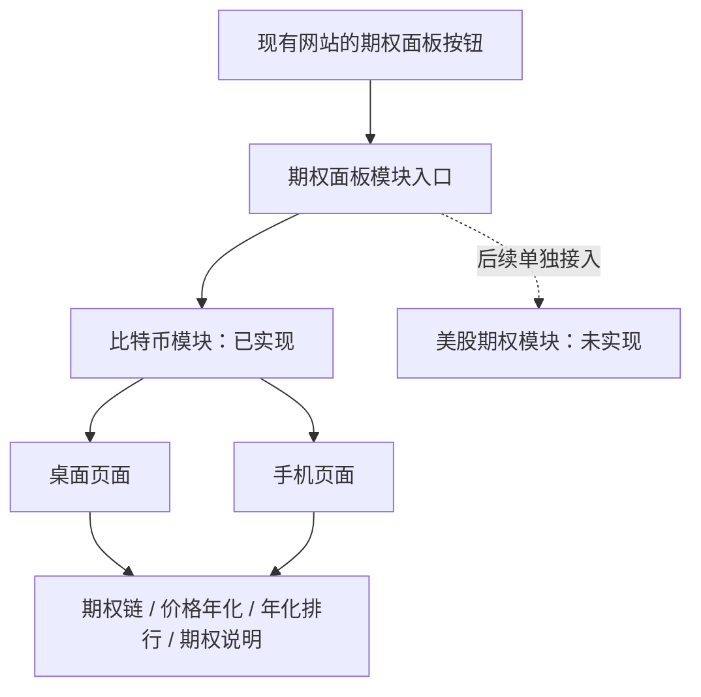
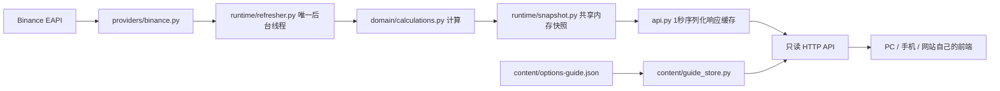

# 架构与代码导航

## 产品层级

模块目录与模块登记表分开。`modules/registry.py` 只声明可用模块的 ID、名称、来源、页面路径。`web/hub/hub.js` 读取登记接口生成卡片。加入卡片不等于实现一个市场的数据源；新增市场还需自己的适配、状态、路由和测试。

## 数据与请求流

用户请求不会触发外部行情采集。后台默认每 60 秒更新行情、每 600 秒更新合约目录。浏览器约每 5 秒读取本地状态，用于恢复连接和更新倒计时；这不代表 Binance 每 5 秒刷新。年化、单期收益和概率只在成功提交的行情代次改变。读快照时仍会更新状态年龄、剩余时间及到期/结算窗口展示。

一次采集包含多个外部请求，不能称为交易所同时刻的原子快照。程序在同一批次中使用同一个未取整指数和最终服务器时间统一计算，避免页面自行混用不同指数或逐秒放大旧年化。

## 后端文件职责

| 文件（相对 `src/options_panel/`） | 责任 / 修改入口 |
| --- | --- |
| `__init__.py`、`__main__.py` | 包和命令行入口 |
| `cli.py` | 解析启动参数；调用 Uvicorn，固定一个 worker |
| `config.py` | 环境变量、目录和刷新常量 |
| `api.py` | 应用生命周期、路由、只读限制、静态资源白名单、健康检查、短缓存 |
| `logging.py` | 结构化 JSON 日志、轮转、控制台回退 |
| `domain/calculations.py` | 数值校验、内在价值、时间价值、收益、概率；不发网络请求 |
| `providers/binance.py` | Binance HTTP 调用、重试、协议解析及单位校验 |
| `runtime/snapshot.py` | BTC 快照、整轮提交、过期判断、冻结结果；尚非所有市场通用模型 |
| `runtime/refresher.py` | BTC 采集编排、OI 有界并发、失败退避、进程锁 |
| `modules/bitcoin.py` | 将 BTC 状态和说明存储组成模块上下文 |
| `modules/registry.py` | 对网站公开的模块元数据 |
| `content/guide_store.py` | 只读加载、校验和缓存说明 JSON |

## 生命周期与一致性

1. FastAPI lifespan 配置日志，取得运行目录中的 OS 文件锁，再启动唯一 `Refresher`。
2. `DashboardState` 用锁保护提交与读取。关键数据失败保留上次完整行情；mark 参数失败允许主行情提交，但不混入旧概率参数。
3. 计算结果随行情一起保存。`SnapshotResponseCache` 最多每秒序列化一次，所有 HTTP 访客复用响应字节，GZip 压缩较大响应。
4. 关闭时通知采集线程，最多等待 15 秒。如果仍在网络 I/O，保留采集锁到进程退出，防止第二采集器重叠。部署管理器应允许有界退出；容器示例给 300 秒停止宽限。
5. 缓存只在内存中。重启后先显示等待数据，不把旧磁盘行情冒充新行情。日志不是数据库。

文件锁通过 Windows `msvcrt`、Unix `flock` 实现；锁文件留在磁盘并不表示锁仍被持有。不要删除正在运行的锁文件。锁只保护**同一运行目录**，不是跨服务器的分布式锁。

## 公共网站边界

- 公共 API 没有编辑、下单、账户、凭证、任意 URL 代理或本地文件读取接口。
- 说明内容通过代码审核/发布流程更新。原本地“依据 localhost 判断可编辑”的逻辑不进入公网版。
- Host 白名单和同源资源策略默认开启，没有通配 CORS。iframe 默认仅同源允许。
- 多 worker/多副本并不共享内存。扩大规模前，将唯一采集器与 Redis 等共享存储分离，再部署无采集职责的 API 实例。当前没有实现这一分布式模式。
- 没有框架迁移到 React：现有交互已成熟，保留原生页面可减少回归。团队可只使用版本化 JSON API，用自己的网站技术栈重做界面。

## 单期收益共享展示

后端 `domain/calculations.py::yield_metrics()` 统一计算 `period_return_pct`，每轮成功行情冻结到快照；页面不重新计算收益。PC 和手机版的期权链、价格年化、年化排行均调用 `web/shared/period-return.js` 的 `OptionsPeriodReturn.render(contract, snapshot.index_price)`，样式只在 `web/shared/period-return.css` 定义。新增视图应加载这两个资源并复用该函数，不能复制格式化规则。`model()` 提供相同输入对应的展示数据。

Call 第一行为行权价距同轮指数价的幅度，第二行为后台单期收益；两行等字号、右对齐，第二行非负数预留一个符号空格。Put 仅显示单期收益。零持仓和不可用值沿用原规则，格式化不会改动源数据。
